# 💬 MitraLink - Real-Time Chat Application

MitraLink is a **real-time chat application** built with the MERN stack and Socket.IO.  
It supports **private & group messaging**, media sharing, typing indicators, message status (sent, delivered, seen), and real-time online/offline presence.  

### Website Demo Link: https://mitra-link.vercel.app


## 🚀 Features
- 🔐 **Authentication & Authorization**
  - Secure JWT-based login & signup
  - Passwords stored with bcrypt hashing
- 💬 **One-to-One Chat**
  - Real-time private messaging
  - online/offline presence.
  - Typing indicators for active chats
  - message status (sent, delivered, seen)
- 👥 **Group Chat**
  - Create and join groups
  - Real-time group messaging
  - Typing indicators for group members
- 🖼️ **Media Support**
  - Send images (uploaded via Cloudinary)
- 👀 **Message Status**
  - Sent ✅ | Delivered 📩 | Seen 👁️ indicators
- 🟢 **Presence System**
  - Online/offline users shown in sidebar
- 📱 **Responsive UI**
  - Mobile-first design using TailwindCSS
- ⚡ **Real-Time Updates**
  - Powered by **Socket.IO**


## 🛠️ Tech Stack
**Frontend**
- React.js (Vite)
- TailwindCSS
- Zustand (state management)
- React Router

**Backend**
- Node.js & Express.js
- MongoDB with Mongoose
- Socket.IO
- Cloudinary (media upload)

## 📸 Screenshots

### Mobile view
## 📸 Screenshots

<p align="center">
  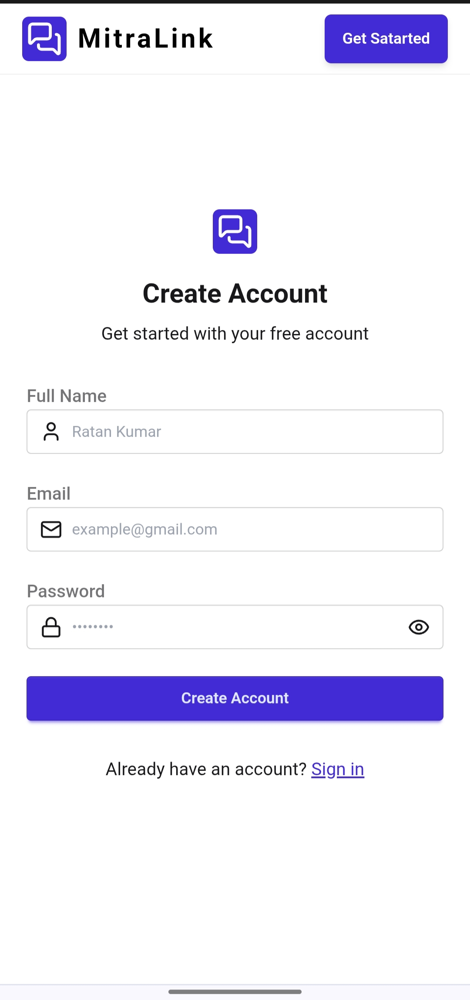
  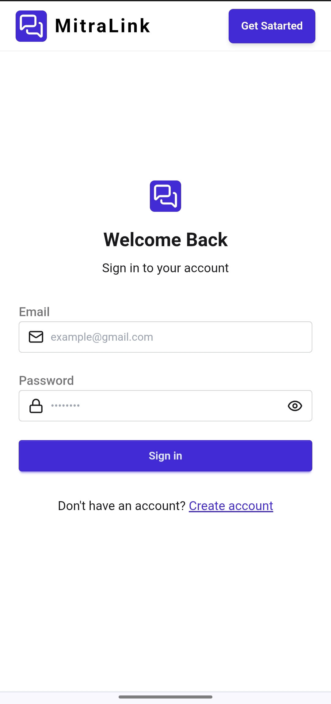
  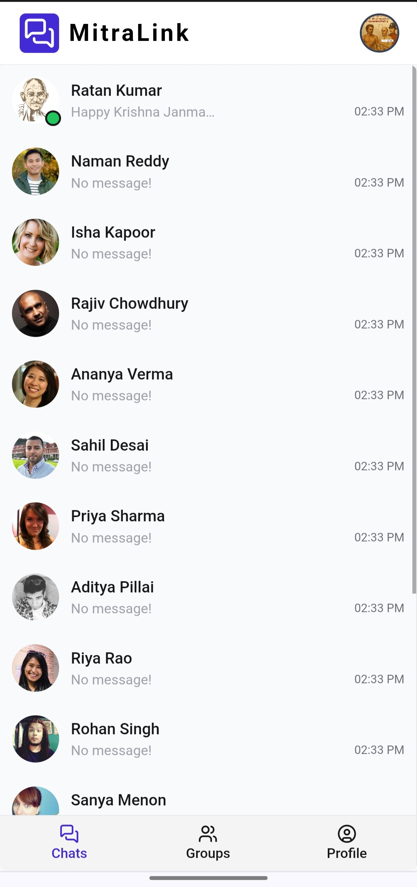
</p>

<p align="center">
  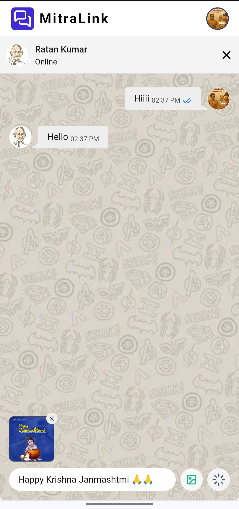
  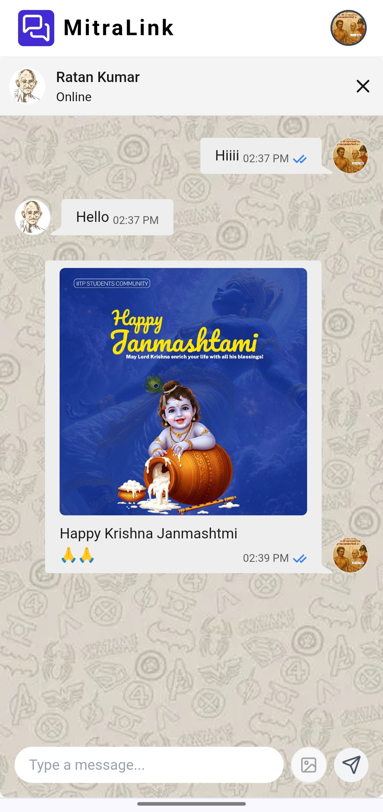
  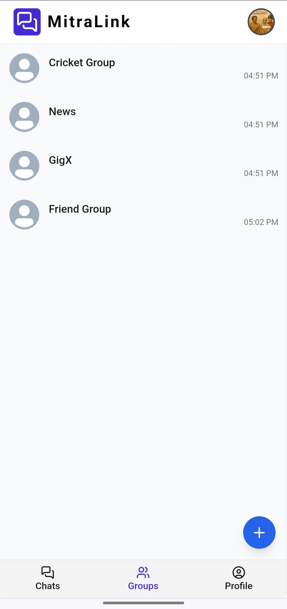
</p>

<p align="center">
  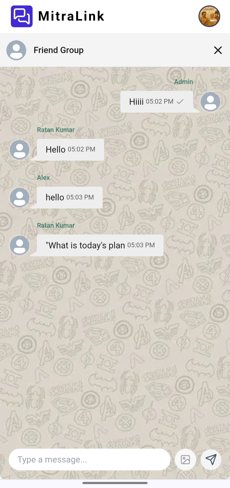
  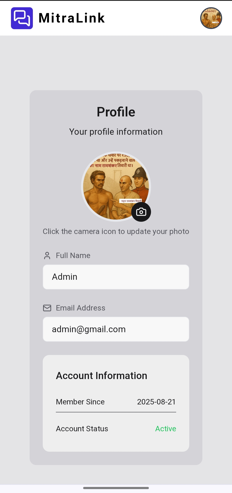
</p>


### Laptop View
- Signup Page
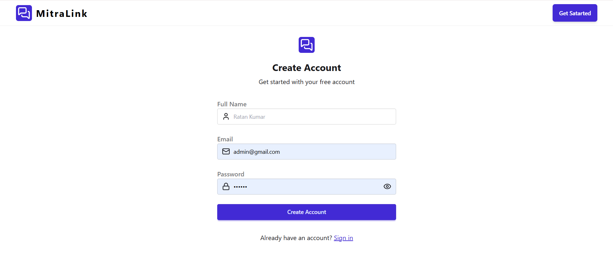
- Login Page
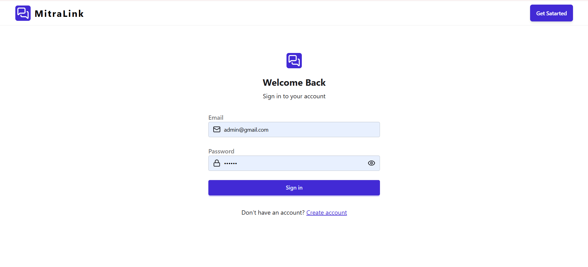
- User Chat List
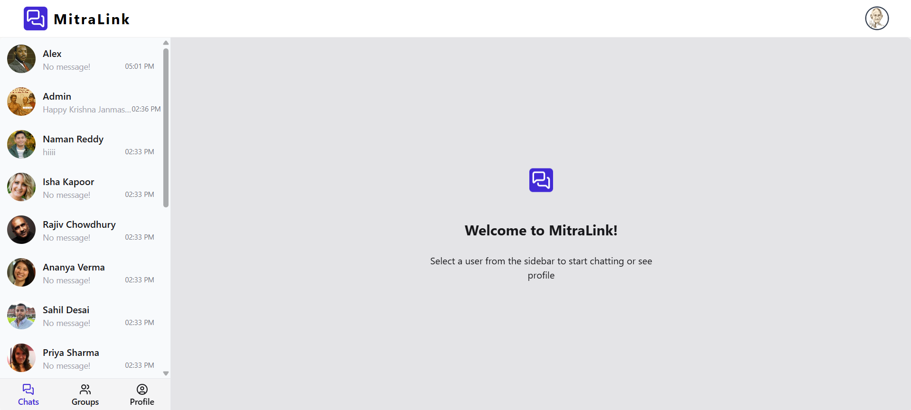
- User Chat
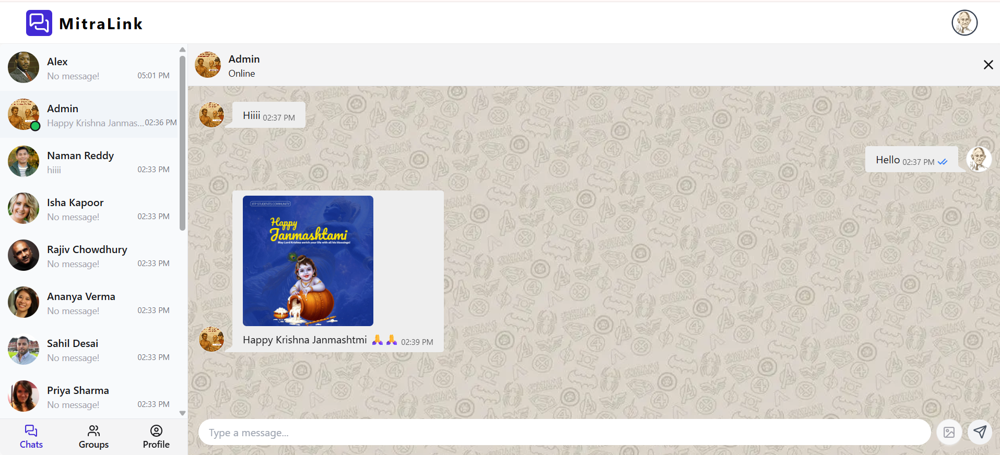
- Group Chat
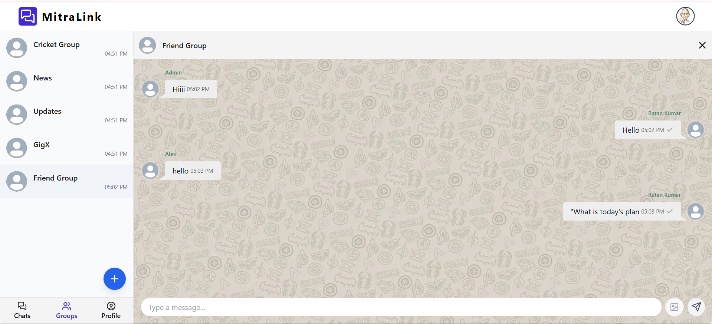
- Create Group
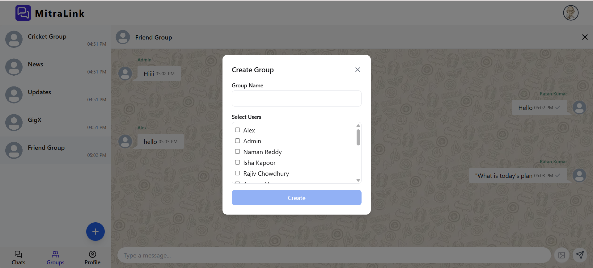

## 📂 Project Structure
```bash
MitraLink/
│── Backend/
│ ├── models/ 
│ ├── routes/ 
│ ├── controllers/
│ └── index.js
│
│── Frontend/
│ ├── src/
│ │ ├── components/
│ │ ├── pages/
│ │ └── store/
│ └── main.jsx
│
└── README.md
```


## ⚙️ Installation & Setup

### 1️⃣ Clone the repository
```bash
git clone https://github.com/your-username/MitraLink.git
cd MitraLink
```
### 2️⃣ Backend Setup
```bash
cd Backend
npm install
```
- Create a .env file:
```bash 
PORT=5000
MONGO_URI=your_mongodb_connection
JWT_SECRET=your_jwt_secret
CLOUDINARY_CLOUD_NAME=your_cloud_name
CLOUDINARY_API_KEY=your_api_key
CLOUDINARY_API_SECRET=your_api_secret
CLIENT_URI=http://localhost:5173
```

- Run backend:
```bash 
npm run dev
```

### 3️⃣ Frontend Setup
```bash
cd ../Frontend
npm install
npm run dev
```

### Open app in browser:
👉 http://localhost:5173

## 📜 License
*This project is licensed under the MIT License.*

## 👨‍💻 Author
**Ratan Kumar**  
🔗 [GitHub](https://github.com/ratan-kumar-git)  
🔗 [LinkedIn](https://www.linkedin.com/in/ratan-kumar-)  


